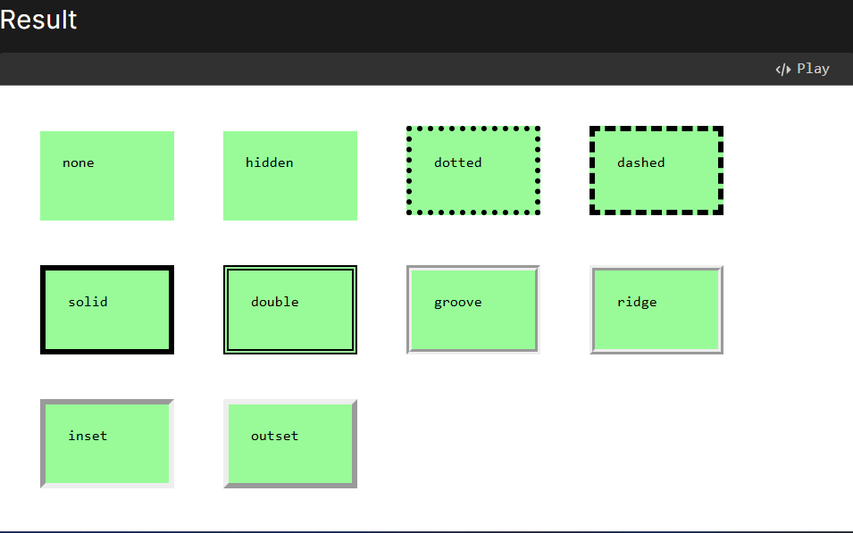

[--> Source link <--](https://developer.mozilla.org/en-US/docs/Web/CSS/border-style#examples)
### Border-Style Property
The `border-style` CSS shorthand defines the style of an element's border on all four sides. Possible values include `none`, `hidden`, `dotted`, `dashed`, `solid`, `double`, `groove`, `ridge`, `inset`, and `outset`. 

**Usage Example:**
```css
/* Top | Right | Bottom | Left */
border-style: solid dashed dotted none;
``` 

It supports one to four values, applies to all elements, and is not inherited.



